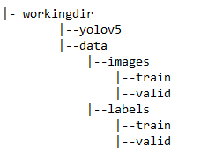

# Developmental Dysplasia of the Hip (DDH)

## What is developmental dysplasia of the hip in children?

Developmental dysplasia of the hip (DDH) is a health problem of the hip joint. It’s when the joint hasn’t formed normally, so it doesn’t work as it should. DDH is present at birth. It is more common in girls than boys. 

In a normal hip joint, the top (head) of the thighbone (femur) fits snugly into the hip socket. In a child with DDH, the hip socket is shallow. As a result, the head of the femur may slip in and out. It may dislocate. This means it moves partly or completely out of the hip socket.

## Object Detection and Yolov5

Object Detection is a task in Artificial Intelligence that focuses on detecting objects in images. [Yolov5](https://github.com/ultralytics/yolov5) is one of the best available models for Object Detection at the moment. The great thing about this Deep Neural Network is that it is very easy to retrain the network on your own custom dataset.

## How do you train a custom Yolo V5 model?
To train a custom Yolo V5 model, these are the steps to follow:

1. Set up your environment
2. Set up the data and the directories
3. Set up the configuration YAML files
4. Train the model to learn how to detect objects
5. Use your custom Yolo V5 model to detect objects on the test data

## 1. How to set up your environment to train a Yolo V5 object detection model?

**First**, clone the repository:
```sh
git clone https://github.com/ultralytics/yolov5 
```
This folder will contain everything you need further on, including pre-trained weights for the model, and a specific directory structure.

**Second**, install pytorch and other required packages:
```sh
pip install -r yolov5/requirements.txt
```
Yolo V5 runs on Torch, which may sometimes be complicated to install. If you struggle here, you can move to a Kaggle or Colab notebook: those generally work well for this installation.

## 2. How to set up the data and directories for training a Yolo V5 object detection model?
Yolo V5 needs a very specific set up of data folders in order to work.

### Yolo V5 Directory structure



If files are not placed in the right directory, you are likely to encounter errors later on.

### Yolo V5 Data Format

#### The images
The images have to be directly in the image folders. Training images in the data/images/train folder and validation images in the data/images/valid folder. The names of the images have to be simply unique names with a .jpg (or another format).

#### The labels
The labels have to be in the data/labels/train/ or in the data/labels/valid. The name of the labels file has to be the same name as the image, but with “.txt” instead of “.jpg”.

The bounding boxes have to be listed as one bounding box per line, with on that line:
- The class number of the object in the bounding box (always 0 if only one class)
- The standardized center pixel of the bounding box in terms of width
- The standardized center pixel of the bounding box in terms of height
- The standardized width of the bounding box
- The standardized height of the bounding box

Standardization is done by dividing the number of pixels by the total number of pixels of the image. So a bounding box on pixel (10, 20) with a width of 30x40 on a picture of size (100, 100) would be standardized to (0.1, 0.2, 0.3, 0.4).


# 3. How to configure the YAML files for training a Yolo V5 Object Detection Model?
To start training a Yolo V5 model you need two YAML files.

The first YAML is to specify:
- where your training data is
- where your validation data is
- the number of classes that you want to detect
- the names corresponding to those classes

This YAML looks like this:
```sh
# train and val datasets (image directory or *.txt file with image paths)
train: training/data/images/train/
val: training/data/images/valid/

# number of classes
nc: 8

# class names
names: ['Labrum', 'Synovial_fold', 'Perichondrium', 'Ilium_plane', 'Osteochondral', 'Lowest_ilium'， 'Femoral_head', 'Bone_top']
```
The second YAML is to specify the whole model, but for getting started I’d advise changing only the first line, “nc”, to have the right number of classes.

```sh
# parameters
nc: 8  # number of classes

...
```

# 4. How to train your custom YoloV5 model?
Training is done using the train.py terminal command, which you can execute from your notebook.

There are multiple hyper-parameters that you can specify, for example, the batch size, the number of epochs, and the image size. You then specify the locations of the two yaml files that we just created above. You also specify a name, which is important later on to find your results.

```sh
python train.py --batch 15 --epochs 200 --data training/dataset.yaml --cfg training/yolov5m.yaml --weights '' --img 384 --device 0 --adam
```

Running this line will create a sub-folder in yolov5 that contains the weights of this trained model, which is needed for the next step.

# 5. How to use your custom Yolo V5 model for object detection on new data?
Now for the final phase, you will want to detect objects on unseen photos. This is done using the terminal command detect.py, which will generate a new folder with outputs. You can either generate pictures with the bounding boxes drawn on them, or you can generate text files with the locations of the bounding boxes.

```sh
python detect.py --weights .\weights\best.pt
```

[Source](https://towardsdatascience.com/yolo-v5-object-detection-tutorial-2e607b9013ef)